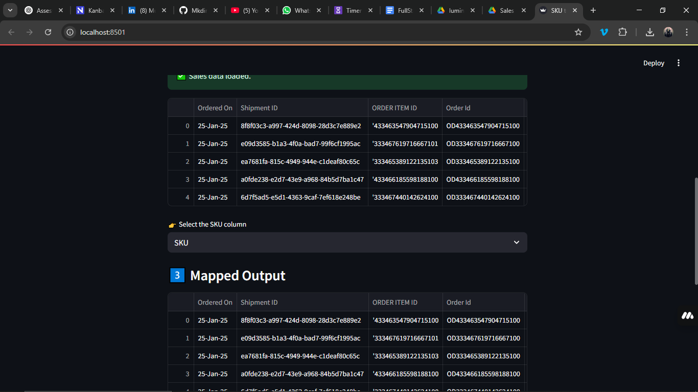
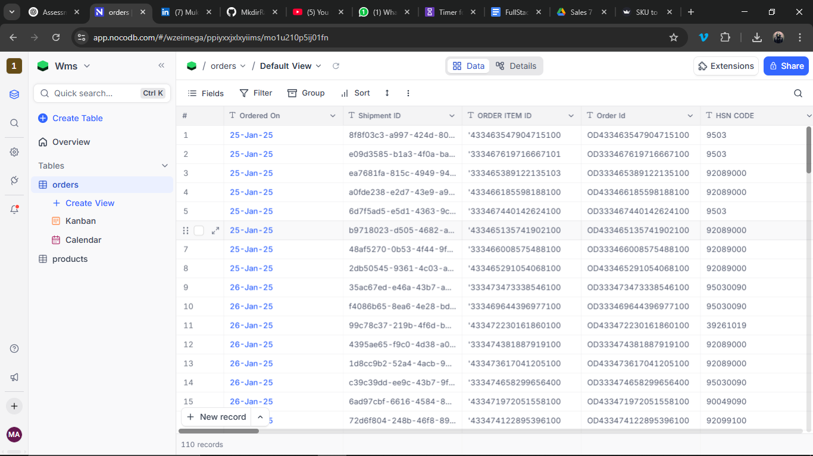
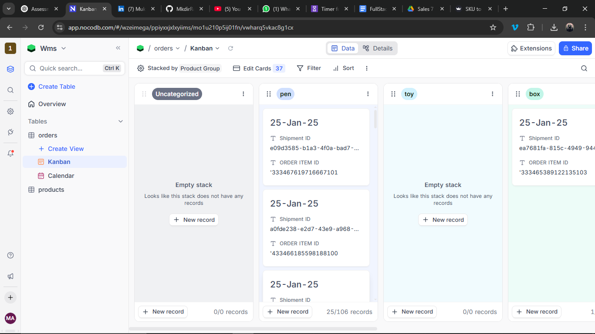
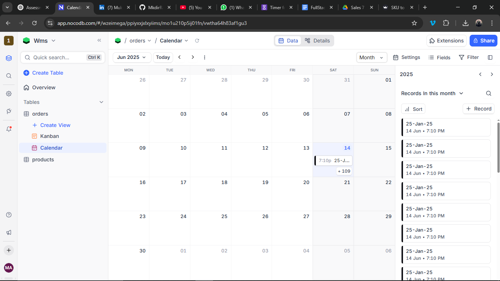
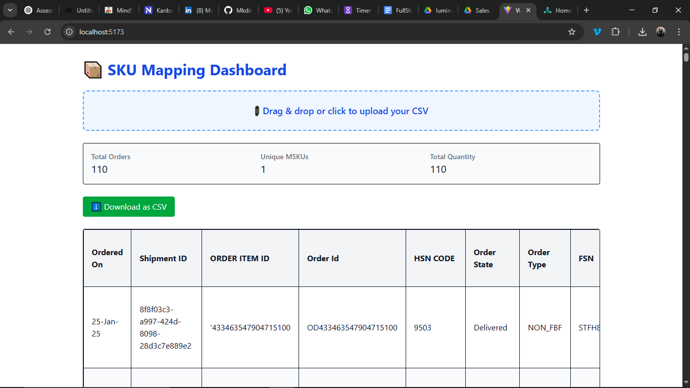

# 📦 WMS Assessment Submission

This project includes all four parts of the WMS assessment, featuring a Python-based data cleaning tool, a relational database via NocoDB, a Vite-based frontend dashboard, and research-backed AI data query tooling.

---

## ✅ Part 1: Data Cleaning & Mapping (Python GUI)

**Tool Used:** Streamlit

### Features:

- Uploads mapping file (`sku_msku_mapping.csv`) and one or more sales data files
- Maps SKU → MSKU (including support for combo MSKUs)
- Logs unmapped SKUs to `unmapped_log.txt`
- Exports cleaned `mapped_output.csv`

### Usage:

```bash
streamlit run app.py
```

### Files:

- `app.py` – Streamlit GUI
- `sku_mapper.py` – Mapping class
- `sku_msku_mapping.csv` – Sample mapping
- `mapped_output.csv` – Output CSV
- `unmapped_log.txt` – Optional error report



---

## ✅ Part 2: Relational Database & Dashboard (NocoDB)

**Tool Used:** NocoDB (Free Cloud Workspace)

### Structure:

- `Orders` table from `mapped_output.csv`
- `Products` table created manually from MSKUs
- Relationship: `Mapped MSKU` (Orders) → `MSKU` (Products)

### Views Created:

- Grid View (default)
- Kanban View (grouped by `MSKU Tag`)

### Benefits:

- No-code interface for viewing and editing sales records
- Visual separation by category/product tag





---

## ✅ Part 3: Frontend Integration (React + Vite)

**Tool Used:** React + Vite + Tailwind CSS

### Features:

- Drag-and-drop CSV upload via `react-dropzone`
- CSV parsing via `papaparse`
- Displays:
  - Total Orders
  - Unique MSKUs
  - Total Quantity
- Full data table rendered
- CSV export/download button

### Run Locally:

```bash
cd wms-dashboard
npm install
npm run dev
```



---

## ✅ Part 4: AI Over Data Layer (Research)

**Reference Tool:** Lumina AI

Although not implemented due to time and access constraints, Lumina AI is well-suited for this part. It supports:

- Natural language to SQL query
- Generated charts from structured CSV
- Adding calculated fields (e.g., `total_price = quantity × price`)

### Recommendation:

In a production scenario, connecting `mapped_output.csv` to Lumina AI or a tool like TextQL would allow business teams to query insights directly without technical knowledge.

---

## 📽 Loom Demo

📎 [Loom Video](https://www.loom.com/share/be22d0c2e1694e2d97baf25d57a461c9?sid=5b41b284-cd4b-464c-a949-da6c848c37a6)

---

## 📁 Submission Folder Structure

```
your-repo/
├── README.md
├── app.py
├── sku_mapper.py
├── sku_msku_mapping.csv
├── mapped_output.csv
├── unmapped_log.txt
├── wms-dashboard/
│   ├── src/
│   │   ├── App.jsx
│   │   └── components/Upload.jsx
│   └── package.json
├── screenshots/
│   ├── part1_streamlit.png
│   ├── part2_nocodb_grid.png
│   ├── part2_nocodb_kanban.png
│   └── part3_frontend.png
```

---

✅ Ready for evaluation. For questions, contact: 1996raiden27@gmail.com
